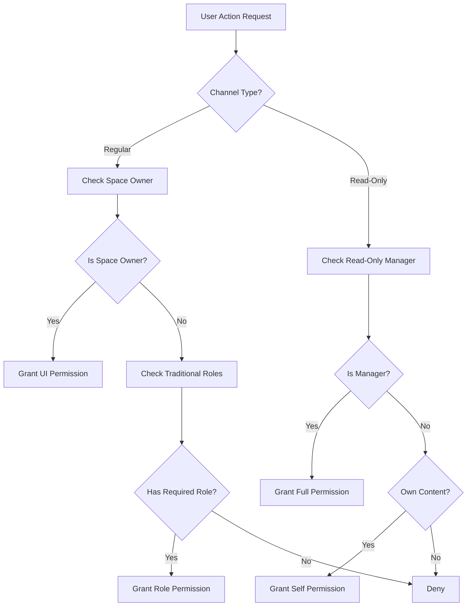

# Space Permissions Architecture

## Overview

Quorum's space permission system is designed around a **layered, hierarchical architecture** that combines multiple permission models to provide flexible access control across different contexts. The system balances user empowerment through role delegation with the need for controlled environments like announcement channels.

## Core Architecture Principles

### 1. Permission Hierarchy

```
1. Own Content (highest) → Users always control their own messages
2. Read-Only Channel Managers → Isolated permissions in specific channels
3. Traditional Roles → Permission grants through role assignments
4. Space Owner → UI permissions only (processing not implemented)
```

### 2. Dual Permission Models

The system operates two **parallel but coordinated** permission models:

#### **Traditional Space Roles** (Space-wide)

- **Scope**: Entire space, all regular channels
- **Permissions**: `message:delete`, `message:pin`, `user:kick`
- **Management**: Created and assigned by space owners
- **Enforcement**: Throughout the space in regular channels

#### **Read-Only Channel Managers** (Channel-specific)

- **Scope**: Individual read-only channels only
- **Permissions**: Full control (post, delete, pin) within managed channels
- **Management**: Assigned per channel using existing role system
- **Isolation**: Completely separate from traditional role permissions

### 3. Processing Architecture

#### **UI Level Permissions**

- **Purpose**: Determine what actions users can attempt
- **Implementation**: Unified permission checking system
- **Components**: Buttons, UI states, visual indicators
- **Logic**: Shows/hides actions based on all permission types

#### **Service-Oriented Processing (via MessageDB Context)**

- **Purpose**: Validate and execute actual operations
- **Processing Level**: Validated independently within the relevant service (e.g., `MessageService`, `SpaceService`) exposed via `MessageDB Context`.
- **Validation**: Ensures UI permissions match processing permissions
- **Security**: Final authorization layer

## Permission System Integration

### How Systems Work Together

1. **Regular Channels**:
   - Space owners get UI permissions only (processing not implemented)
   - Traditional roles get both UI and processing permissions
   - Read-only manager permissions are ignored (channel not read-only)

2. **Read-Only Channels**:
   - Space owners get UI permissions only (processing not implemented)
   - Read-only managers get both UI and processing permissions
   - Traditional role permissions are blocked (isolation principle)

3. **Self-Content**:
   - Users always control their own messages (both UI and processing)
   - Works consistently across all channel types

### Permission Resolution Flow



## System Boundaries and Isolation

### Read-Only Channel Isolation

**Critical Design Decision**: Read-only channels operate as completely isolated permission environments.

- **Traditional roles cannot override read-only restrictions**
- **Only designated managers have permissions in read-only channels**
- **Space owners use UI permissions but need architectural consideration for processing**

### Processing Limitations

- **Space owners in regular channels**: May need traditional roles with delete permissions
- **Service-oriented processing**: Validation is now handled by specialized services (e.g., `MessageService`, `SpaceService`) exposed via `MessageDB Context`, and is currently limited to role-based and self-delete validation.
- **Architectural gap**: Space owner verification within the relevant service exposed via `MessageDB Context` needs resolution.

## Implementation Structure

### Core Files

#### **Permission Logic**

- `src/utils/permissions.ts` - Traditional role permission checking
- `src/utils/channelPermissions.ts` - Unified UI permission system
- `src/components/context/MessageDB.tsx` - Provides access to services (e.g., `MessageService`, `SpaceService`) that handle processing validation.

#### **Space Role Management**

- `src/hooks/business/spaces/useRoleManagement.ts` - Role CRUD operations
- `src/hooks/business/user/useUserRoleManagement.ts` - User-role assignments
- `src/components/modals/SpaceSettingsModal/SpaceSettingsModal.tsx` - Role management UI

#### **Read-Only Channel System**

- `src/hooks/business/channels/useChannelManagement.ts` - Channel configuration
- `src/components/modals/ChannelEditorModal.tsx` - Read-only channel settings
- `src/components/space/Channel.tsx` - Permission integration

### Data Models

#### **Space Roles**

```typescript
export type Role = {
  roleId: string;
  displayName: string;
  roleTag: string;
  color: string;
  members: string[];
  permissions: Permission[];
};

export type Permission = 'message:delete' | 'message:pin' | 'user:kick';
```

#### **Read-Only Channels**

```typescript
export type Channel = {
  // ... existing fields
  isReadOnly?: boolean;
  managerRoleIds?: string[];
};
```

## Current System Status

### ✅ Fully Working

- **Self-delete permissions**: Users can delete own messages everywhere
- **Read-only manager system**: Complete isolation and functionality
- **Traditional role system**: Space-wide permissions working correctly
- **UI permission checking**: Unified system shows correct buttons/states

### ❌ Known Issues

- **Space owner delete messages**: UI shows buttons but processing not implemented - buttons do nothing
- **Cryptographic validation gap**: Space ownership cannot be verified in distributed message processing
- **Security challenges**: Previous attempts introduced vulnerabilities, reverted

### ⚠️ Architectural Considerations

- **Permission consistency**: UI permissions vs processing permissions misalignment for space owners
- **System expansion**: Architecture ready for additional permission types
- **Security first**: Any space owner implementation must not compromise message validation

### 🔧 Future Enhancements

- **Enhanced space owner support**: Proper processing for space owners within the relevant service (e.g., `SpaceService`) exposed via `MessageDB Context`.
- **Permission expansion**: Additional permission types beyond current three
- **Role hierarchy**: Advanced role inheritance and priority systems
- **Audit capabilities**: Permission usage tracking and logging

## Development Guidelines

### When Working on Permissions

1. **Understand the dual model**: Traditional roles vs read-only managers
2. **Respect isolation**: Read-only channels ignore traditional roles
3. **Check both levels**: UI permissions AND processing validation
4. **Consider hierarchy**: Space owners → own content → specific systems → traditional roles

### Integration Patterns

1. **UI Components**: Use unified permission system from `channelPermissions.ts`
2. **Processing Logic**: Validate within the relevant service (e.g., `MessageService`, `SpaceService`) exposed via `MessageDB Context` with current working patterns.
3. **New Features**: Follow existing isolation and hierarchy principles
4. **Testing**: Verify both UI behavior and processing validation

## Related Documentation

- **[Space Roles System](./space-roles-system.md)** - Traditional role-based permissions
- **[Read-Only Channels System](./read-only-channels-system.md)** - Isolated read-only channel permissions

---

_Last Updated: 2025-09-11_  
_Architecture Status: Partial - Core systems working except space owner delete permissions (reverted due to security issues)_
